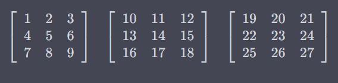

A _rank-3 tensor_ is a stack of matrices. It is a 3-dimensional array of numbers.

The rank of a tensor is independent of its _shape_ or _dimensionality_, e.g., a tensor of shape 2x2x2 and a tensor of shape 3x5x7 both have rank 3.

_Rank_ is the number of axes or dimensions in a tensor; _shape_ is the size of each axis of a tensor.

A rank-3 tensor is essentially a cube of numbers.

Example:

To index a number of that tensor, you would need:

- the layer
- the row
- the column