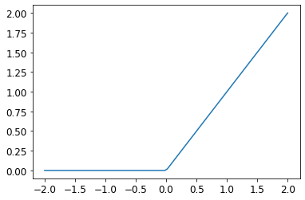

The _ReLu_ (Rectified Linear Unit) is defined as `max(0,x)`. It basically means "replace any negative numbers with 0".

It is commonly used in neural networks to add non-linearity to the model, while having less computational cost than other activation functions.

Here is what a _ReLu_ looks like:

