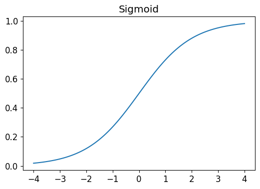

The Sigmoid function is a smooth curve that squishes all values into values between 0 and 1. 

Sigmoid function is used a lot in deep learning as this fields always requires to normalize data at some point.

Moreover, its smooth curve makes it easier to find meaningful gradients.