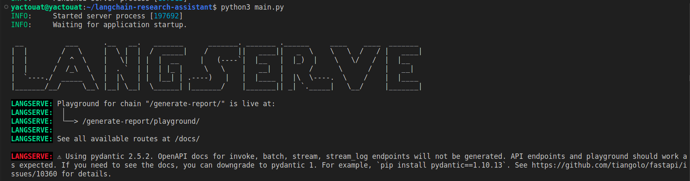

I've built my first LangChain app following this excellent [LangChain web search assistant YouTube tutorial](https://www.youtube.com/watch?v=DjuXACWYkkU), here are the steps I took to build it and some additional notes.

## TL;DR: show me the code

Here is what you came from, the code of this LangChain research assistant: [https://github.com/yactouat/langchain-research-assistant](https://github.com/yactouat/langchain-research-assistant). 

## generic steps to build a LangChain app

- [`LangSmith`](https://www.langchain.com/langsmith) is a very handy tool to log and debug LangChain applications; you should sign up to this first hand
- get your environment sorted, whatever AI API you're using (Vertex AI, OpenAI, Mistral, etc.)
- from LangChain `langchain.chat_models` import your chat model of choice
- using the `ChatPromptTemplate` class, write the prompt template that is relevant for the task at hand
- also import the output parser of your choosing, the simplest being `StrOutputParser`, that just parses the bot reply into a string
- creating chains is quite intuitive as it relies on the `|` character, for instance =>

    ```python
    webpage_summarization_chain = prompt_from_template | ChatOpenAI(model="gpt-4-1106-preview") | StrOutputParser()
    ```

- you would then invoke your chain and retrieve its results like so, based on the variables you have defined in your prompt template =>

    ```python
    webpage_summarization_chain = RunnablePassthrough.assign(
        # anonymous function that takes no arguments, and returns the output of `scrape_text`, a function that gets some webpage text
        content=lambda input_obj: scrape_text(input_obj["url"])
    ) | prompt_from_template | ChatOpenAI(model="gpt-4-1106-preview") | StrOutputParser()
    summarization_job = webpage_summarization_chain.invoke(
        {
            "question": "what is this page about?",
            "url": url
        }
    )
    print(summarization_job)
    ```

- you can add specific tasks to your chain using `langchain.schema.runnable` `RunnablePassthrough` class, which helps passing data through a chain, here is an example =>

    ```python
    webpage_summarization_chain = RunnablePassthrough.assign(
        # anonymous function that takes no arguments, and returns the output of `scrape_text`
        content=lambda _: scrape_text(url)
    ) | prompt_from_template | ChatOpenAI(model="gpt-4-1106-preview") | StrOutputParser()
    summarization_job = webpage_summarization_chain.invoke(
        {
            "question": "what is this page about?",
            "url": url
        }
    )
    print(summarization_job)
    ```

- if you're doing any web search with your agentic application, you may want to use LangChain utilities such as `DuckDuckGoAPIWrapper`, they are pretty handy as you can see =>


    ```python
    from langchain.utilities import DuckDuckGoAPIWrapper

    ddg_search = DuckDuckGoSearchAPIWrapper()
    def web_search(query: str, num_results: int = 10):
        results = ddg_search.results(query, num_results)
        return [r["link"] for r in results]
    ```
- if you need to loop over several elements and apply the same chain to each one (for instance urls), you can do something like =>

    ```python
    webpage_summarization_chain = RunnablePassthrough.assign(
        # anonymous function that takes no arguments, and returns the output of `scrape_text`
        content=lambda input_obj: scrape_text(input_obj["url"])
    ) | prompt_from_template | ChatOpenAI(model="gpt-4-1106-preview") | StrOutputParser()

    # return a list of urls based on the input query,
    # then construct a dictionary list with the query and each url,
    # then we apply the webpage summarization chain to each dictionary using the chain `map` method
    webpages_summarization_chain = RunnablePassthrough.assign(
        urls=lambda input: web_search(input["query"])
    ) | (lambda list_of_urls: [
        {
            "query": list_of_urls["query"],
            "url": link
        } for link in list_of_urls["urls"]
    ]) | webpage_summarization_chain.map()

    summarization_jobs = webpages_summarization_chain.invoke(
        {
            "query": "what is the difference between AI safety and AI security?"
        }
    )
    ```

- don't forget that even intermediate steps inputs of your chains, such as web search queries for instance, can be generated by an LLM 😉 =>

    ```python
    web_search_prompt_messages = [
        ("user", """write 3 DuckDuckGo search queries to search online for an objective answer to the following query: {query}\n
        -----------------------------------------------------------------------------------------------------------
        you must respond with a list of strings in the following format: '["query 1", "query 2", "query 3"]'
        """)
    ]
    web_search_prompt = ChatPromptTemplate.from_messages(web_search_prompt_messages)
    ```

- this way, you can retrieve queries to feed to your general web search and get individual search results as in =>

    ```python
    web_search_queries_chain = web_search_prompt | ChatOpenAI(model="gpt-4-1106-preview") | StrOutputParser() | json.loads
    web_search_queries_job = web_search_queries_chain.invoke(
        {
            "query": "what is the difference between AI safety and AI security?"
        }
    )
    print(web_search_queries_job) # ['difference between AI safety and AI security', 'AI safety vs AI security comparison', 'defining AI safety and AI security']

    # now we can combine the web search queries and the webpages summarization chain
    web_search_chain = web_search_queries_chain | (lambda list_of_queries: [{
        "query": q
    } for q in list_of_queries]) | webpages_summarization_chain.map()

    # getting intermediate search results summarized
    search_results = web_search_chain.invoke(
        {
            "query": "what is the difference between AI safety and AI security?"
        }
    )
    for search_result in search_results:
        print(search_result)
    ```

- now we are ready to build our final web search reports from various sources! research prompt was heavily inspired from [GPT Researcher repo](https://github.com/assafelovic/gpt-researcher) =>

    ```python
    system_research_assistant_prompt = """"you are an AI research assistant, your job is to write objective reports with a given input summary"""
    research_prompt_template = """
    -----------------------------------------------------------------------------------------------------------
    input summary: {summary}
    -----------------------------------------------------------------------------------------------------------
    using the above input summary only and without tapping into your own knowledge, answer to the following query in a comprehensive manner;
    at the top of the report should be a top-level heading reading "Answer to the query: {query}";
    right below the top level heading, the date should be written in the following format: {date};
    write your answer as a structured report in Markdown with relevant headings and subheadings;
    the report should contain a table of contents at the beginning, each item in the table of contents should be a link to the relevant header in the report using only Markdown syntax for links and not HTML;
    -----------------------------------------------------------------------------------------------------------
    query: {query}
    -----------------------------------------------------------------------------------------------------------
    """
    research_prompt = ChatPromptTemplate.from_messages([
        ("system", system_research_assistant_prompt),
        ("user", research_prompt_template)
    ])

    web_search_report_chain = RunnablePassthrough.assign(
        date=lambda _: datetime.now().strftime('%B %d, %Y'),
        # joining the list of lists of search results into a string
        summary= web_search_chain | (lambda search_results: "\n".join([f"---\n{' '.join([text for text in sr])}\n---" for sr in search_results]))
    ) | research_prompt | ChatOpenAI(model="gpt-4-1106-preview") | StrOutputParser()

    report = web_search_report_chain.invoke(
        {
            "query": "what is the difference between AI safety and AI security?"
        }
    )
    ```

    ... you get this nicely formatted report as an output 📄

    ```markdown
    # Answer to the query: What is the difference between AI safety and AI security?
    **December 23, 2023**

    ## Table of Contents
    1. [Introduction](#introduction)
    2. [Definition of AI Safety](#definition-of-ai-safety)
    3. [Definition of AI Security](#definition-of-ai-security)
    4. [Key Differences](#key-differences)
    5. [Conclusion](#conclusion)

    <a name="introduction"></a>
    ## Introduction
    The following report outlines the distinctions between AI safety and AI security as derived from the provided content. It aims to delineate the separate challenges and objectives each field addresses in the context of artificial intelligence systems.

    <a name="definition-of-ai-safety"></a>
    ## Definition of AI Safety
    AI safety is the discipline that encompasses efforts to ensure that AI systems operate reliably and as intended, without causing unintended harm. It is concerned with the misuse or malfunctioning of AI systems and seeks to mitigate potential damage resulting from such events. AI safety involves the design and operation of AI systems to reduce risks to physical security and prevent unreasonable safety risks to humans and the environment.

    <a name="definition-of-ai-security"></a>
    ## Definition of AI Security
    AI security, in contrast, focuses on defending AI systems against external threats, such as cyber-attacks, unauthorized access, or data breaches. Security measures are implemented to protect the integrity and confidentiality of AI systems and to prevent malicious actors from subverting the system or stealing the underlying model or its associated data. This includes employing techniques like user-access controls and encryption to protect against adversarial attacks that could compromise the system's intended functions.

    <a name="key-differences"></a>
    ## Key Differences

    | Aspect          | AI Safety                                     | AI Security                                 |
    |-----------------|-----------------------------------------------|---------------------------------------------|
    | Focus           | Preventing harm from system's own behavior    | Protecting systems from external threats    |
    | Concerns        | Unintended harm, reliability, design errors   | Cyber-attacks, unauthorized access, theft   |
    | Techniques      | Risk management, reliable design              | Encryption, user-access controls            |

    The key differences between AI safety and AI security as outlined in the content provided are as follows:
    - **Objective**: AI safety aims to minimize harm that could arise from the normal or unexpected functioning of AI systems, whereas AI security aims to safeguard AI systems from malicious interventions.
    - **Scope**: AI safety is concerned with the internal processes and behaviors of AI systems and their potential to cause harm, while AI security deals with external threats to the system's integrity and data.
    - **Strategies**: AI safety strategies involve ensuring the AI behaves reliably and as intended, even in unforeseen circumstances, while AI security strategies involve cybersecurity measures to protect against intellectual property theft and system compromise.

    <a name="conclusion"></a>
    ## Conclusion
    In conclusion, AI safety and AI security are complementary but distinct aspects of AI system development and management. AI safety addresses potential harm caused by the AI itself, whether through misuse or malfunction, while AI security is focused on defending against external threats and malicious exploitation. Understanding and addressing both safety and security is essential for the responsible deployment and trustworthiness of AI technologies.
    ```

- cool tip: you can nest `RunnablePassthrough` instances to compose your pipeline data any way you see fit, for instance I've added the urls in the web pages summaries and updated the report prompt so that it cites the URLs like so =>

    ```python
    research_prompt_template = """
    -----------------------------------------------------------------------------------------------------------
    input summary: {summary}
    -----------------------------------------------------------------------------------------------------------
    using the above input summary only and without tapping into your own knowledge, answer to the following query in a comprehensive manner;
    at the top of the report should be a top-level heading reading "Answer to the query: {query}";
    right below the top level heading, the date should be written in the following format: {date};
    write your answer as a structured report in Markdown with relevant headings and subheadings;
    the report should contain a table of contents at the beginning, each item in the table of contents should be a link to the relevant header in the report using only Markdown syntax for links and not HTML;
    at the end of the report, a level 2 heading of reading "Sources" should precede a bullet points list of all relevant URLs used in the report;
    -----------------------------------------------------------------------------------------------------------
    query: {query}
    -----------------------------------------------------------------------------------------------------------
    """

    webpage_summarization_chain = RunnablePassthrough.assign(
        summary=RunnablePassthrough.assign(
                # anonymous function that takes no arguments, and returns the output of `scrape_text`
                content=lambda input_obj: scrape_text(input_obj["url"])
            ) | summarization_prompt | ChatOpenAI(model="gpt-4-1106-preview") | StrOutputParser()
        ) | (lambda summarization_res: f"URL: {summarization_res['url']}\n\nSUMMARY: {summarization_res['summary']}")
    ```

- now, we have a runnable agent that can search the web and generate reports from the results, why not making it available via a web API? This is exactly what [LangServe](https://github.com/langchain-ai/langserve?ref=blog.langchain.dev) does, the code to run both the server and the client is available and shown in the readme
- on running the web server, a `playground` endpoint is made available so that you can test your agent, this is pretty neat as the UI shows the intermediate steps of your chain =>

    

- you can add as many data sources as you want for your search feature, whether search engines, Arxiv, Wikipedia, vector search, etc. this is incredibly powerful 🤯 I've added Arxiv in the repo so you can check it out.

This is so freaking cool 🤩 I can only imagine future features to add on top of this!

## more on building a LangChain app

### general principles

- don't rely on LLMs context windows, even if they are huge, it is a good practice to split up your tasks in smaller subsets for better performance because:
    - these subtasks are more focused
    - they can be parallelized
    - they can be executed by other models that may be more efficient for the task at hand
- you don't always a need a top-notch model for a given task => think about the costs and the response times and try to save some where you can
- don't hesitate to use the `temperature` parameter of the model you're using if you want to adjust how close to its knowledge base the model should stick to

### `RunnablePassthrough` vs `RunnableLambda`

`RunnablePassthrough` and `RunnableLambda` are two classes that may be involved in data processing pipelines.

`RunnablePassthrough` is primarly used for passing data with minimal or no modification; this is useful when:

- you want to route data without changing it
- you want to add aditional metadata without altering the original data structure

On the other hand, `RunnableLambda` converts a Python callable into a LangChain `Runnable`; this is useful when you want to integrate custom function into your pipelines, for instance:

- you want to use a custom function for data cleaning or formatting
- when you want to perform a complex calculation that you want to integrate into your pipeline

## next steps

- add a layer of authentication to the LangServe web API and its playground or produce a similar web UI with authentication
- fork the [LangChain repo](https://github.com/langchain-ai/langchain), you will find in there, under the `templates` folder, tons of startup apps to get you started, it's very impressive 🤩
- `pip install langchain-cli`, this help you create your own templates
- from within your fork `templates` folder, run `langchain template new MY_APP` and you're ready to go 🚀

## sources

- [GPT Researcher repo](https://github.com/assafelovic/gpt-researcher)
- [LangChain repo](https://github.com/langchain-ai/langchain)
- [LangChain SQL assistant YouTube tutorial](https://www.youtube.com/watch?v=es-9MgxB-uc)
- [LangChain web search assistant YouTube tutorial](https://www.youtube.com/watch?v=DjuXACWYkkU)
- [LangServe repo](https://github.com/langchain-ai/langserve?ref=blog.langchain.dev)